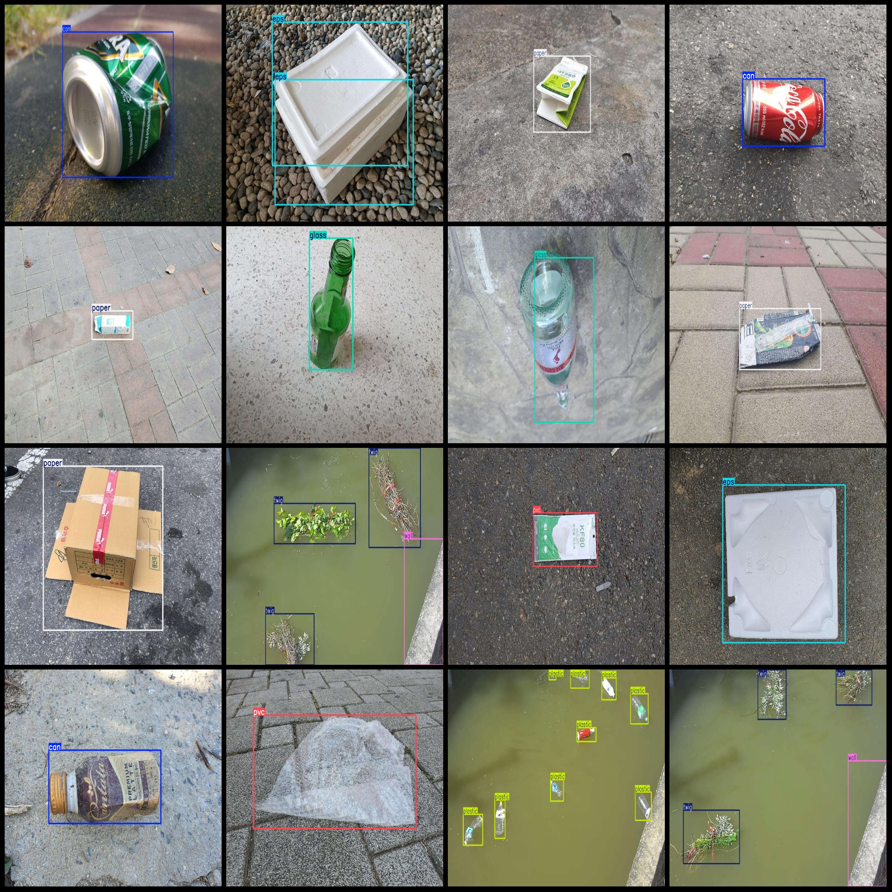
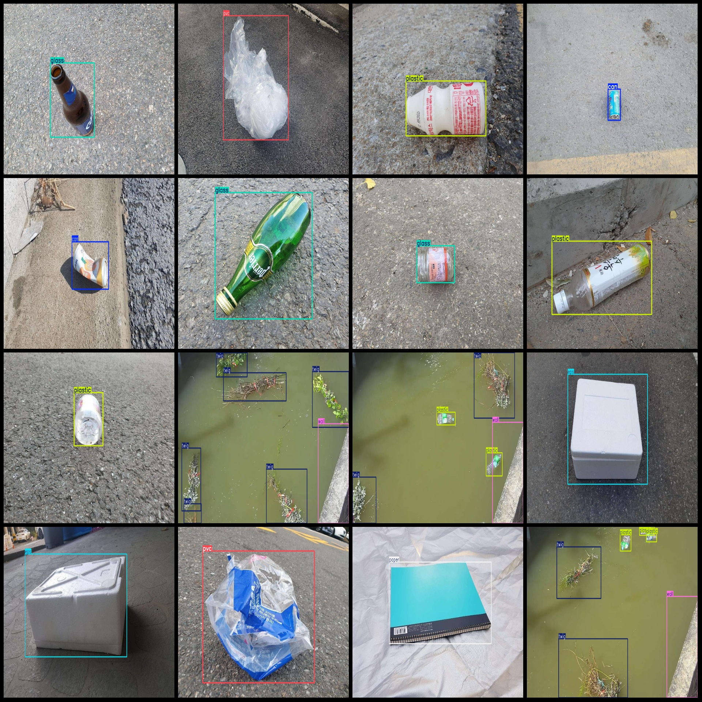

# Plastic Tree Branch Paper Glass Window Polyethylene VOC+YOLO Format
Dataset: 8797 images (jpg files) + 9 categories

Dataset format: Pascal VOC format + YOLO format (txt file without split paths, only containing jpg images and corresponding VOC format xml files and YOLO format txt files)
Number of images (jpg files): 8797
Number of annotations (xml files): 8797
Number of annotations (txt files): 8797
Number of categories: 9
Categories in annotation order (not consistent with the YOLO format, but according to the labels folder "classes.txt"): ["can", "eps", "etc", "glass", "paper", "plastic", "pvc", "twig", "wall"]
Box numbers for each category:
- can (metal can) = 1343
- eps (foam plastic) = 1437
- etc (other) = 129
- glass (glass) = 1383
- paper (paper) = 1397
- plastic (plastic) = 3071
- pvc (polyvinyl chloride) = 1329
- twig (branch) = 2566
- wall (wall) = 782
Total box numbers: 13437
Image resolution: Multi-resolution images, such as 1024x768, 1024x576, etc.
Annotation tool used: labelImg
Annotation rules: Draw boxes around the categories
Important note: No special statement currently exists
Special declaration: This dataset does not guarantee the accuracy of the trained model or the weight file
Image preview:

## Images

Here is a pay link on Stripe ( https://buy.stripe.com/3cs8yP7sY87d0vu9AB ). Please contact me lonlonago@foxmail.com after funding $89, and I will send you a complete data files , thank you!

